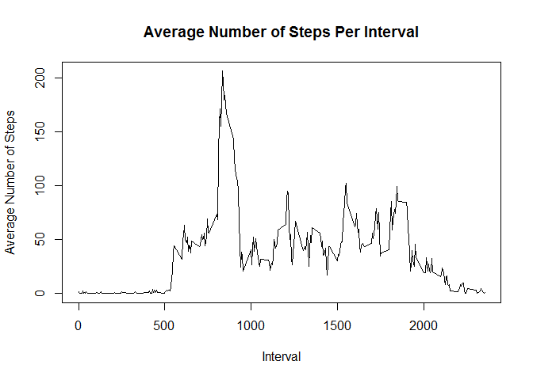
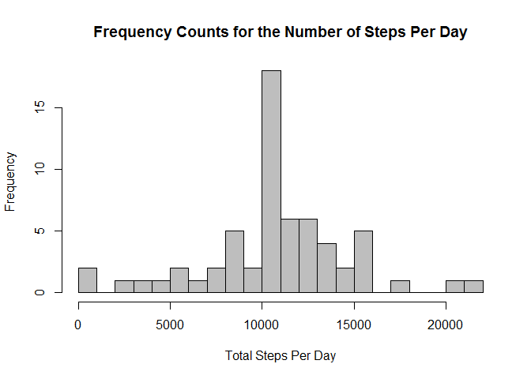

# Reproducible Research Course Project 1
James Carroll  
Wednesday, January 14, 2015  

## Loading and preprocessing the data

The data is initially unzipped using the unzip() command before loading activity.csv using the read.csv() commanded. 


```r
unzip("D:\\Dropbox\\Coursera\\Reproducible Research\\Project 1\\repdata-data-activity.zip")
activity  <- read.csv("activity.csv", header = TRUE, stringsAsFactors=FALSE, na.strings="NA")
```

With the data loaded, preprocessing can begin. The "date" column is overwritten to set the contents as the R Date format using the as.Date() function. Then a subset of the activity.csv dataset is taken where there are values in the "steps" column i.e. entries with NA are removed. 


```r
#Make Proper Date Column
activity$date <- as.Date(activity$date)

#Removing Missing Values
activityNoNA <- activity[!is.na(activity$steps),]
```

This ends the preprocessing that affects all of the sub-parts of this assignment and so we move on to answering the set questions. 

## What is the mean total number of steps taken per day?
To get a sense of the data we plot a histogram of the mean total number of steps taken per day, however first we must determine the average number of steps taken per day. This is done using the tapply() function. 


```r
#Question1
TotalPerDay <- tapply(activityNoNA$steps, activityNoNA$date, sum, na.rm=TRUE, simplify=T)
```

The histogram is then plotted as follows: 


```r
Q1Graph <- hist(x=TotalPerDay, 
                  col="grey", 
                  breaks=20, 
                  xlab="Total Steps Per Day", 
                  ylab="Frequency", 
                  main="Frequency Counts for the Number of Steps Per Day")
```

 

Remembing that missing data have been omitted from all calculations.

Basic descriptive statistics of Mean and Median are calculated and reported below:


```r
#Calculate Mean and Median
TotalMean <- mean(TotalPerDay)
TotalMedian <- median(TotalPerDay)

#Print the Means and Medians
TotalMean
```

```
## [1] 10766.19
```

```r
TotalMedian
```

```
## [1] 10765
```

## What is the average daily activity pattern?
The second part of our analysis looks to daily activity patterns. For this we want to get a sense of the average number of steps taken per 5-Minute Interval over all days (we will consider different days at a later stage).

We use tapply() once again to create an average number of steps per interval period before forming this into a dataframe using data.frame(). The Row names defined by the data.frame() command are infact the interval and so these are replaced as a column rather than the Row Names and then given as an example using the code below. 


```r
#Table the Interval Averages
IntervalAverage <- tapply(activityNoNA$steps, activityNoNA$interval, mean, na.rm=TRUE, simplify=T)
#Turn the results into a dataframe
IntervalAverage <- data.frame(IntervalAverage)
#Populate a column with the row names (Interval Label)
IntervalAverage$Interval <- row.names(IntervalAverage)
#Show an example of the new dataframe
head(IntervalAverage)
```

```
##    IntervalAverage Interval
## 0        1.7169811        0
## 5        0.3396226        5
## 10       0.1320755       10
## 15       0.1509434       15
## 20       0.0754717       20
## 25       2.0943396       25
```

With this new table of data a line graph can be drawn to shown average activity levels: 


```r
#Graph the Averages
Q2Graph <- plot(y=IntervalAverage$IntervalAverage, 
                  x=IntervalAverage$Interval, 
                  type="l", 
                  ylab="Average Number of Steps", 
                  xlab="Interval", 
                  main="Average Number of Steps Per Interval")
```

 

We then move to consider which 5-Minute Interval has the maximum average numbers of steps. To do this we calculate the Maximum Average Number of Steps, then locate that in the table of data and print the interval which holds that number of steps and the maximum number of steps. 


```r
#Maximum Number of Average Steps
MaxSteps <- max(IntervalAverage$IntervalAverage)

#Which interval has this?
MaxStepsInterval <- IntervalAverage[IntervalAverage$IntervalAverage == MaxSteps,]

#Print Max Steps Interval and the Maximum Number of Steps
MaxStepsInterval$Interval
```

```
## [1] "835"
```

```r
MaxStepsInterval$IntervalAverage
```

```
##      835 
## 206.1698
```
## Inputting missing values
We now revisit the missing values, looking first at how many there are. 


```r
#Number of rows with NA's
CompleteRows <- complete.cases(activity)
NumberIncompleteRows <- length(CompleteRows[CompleteRows==FALSE])
NumberIncompleteRows
```

```
## [1] 2304
```

It is sometimes worth while filling these missing values. There are several options to fill these missing values however the method we use here is to fill with the Average of the relevant Interval. 

We create a copy of the activity dataset before creating an index vector identifying which rows have NA's in the steps column using the is.na() function but DO NOT remove them. We then recalculate the Interval Averages using the full dataset and overwrite the NA values using the appropriate intervals calculated Interval Average. 


```r
#Filling empty cells
#Create a new table
TestingDataframe <- activity
#Set a subset of NA's in the steps column
StepsNA <- is.na(TestingDataframe$steps)
#Recalculate the Average Number of Steps across Intervals
IntervalAverage <- tapply(activityNoNA$steps, activityNoNA$interval, mean, na.rm=TRUE, simplify=T)
#Replace the subset of NA's with the appropriate Interval Average
TestingDataframe$steps[StepsNA] <- IntervalAverage[as.character(TestingDataframe$interval[StepsNA])]
```

We have therefore created a copy of the original dataset but with the NA's filled with the average for each interval, the two are shown below. 


```r
head(activity)
```

```
##   steps       date interval
## 1    NA 2012-10-01        0
## 2    NA 2012-10-01        5
## 3    NA 2012-10-01       10
## 4    NA 2012-10-01       15
## 5    NA 2012-10-01       20
## 6    NA 2012-10-01       25
```

```r
head(TestingDataframe)
```

```
##       steps       date interval
## 1 1.7169811 2012-10-01        0
## 2 0.3396226 2012-10-01        5
## 3 0.1320755 2012-10-01       10
## 4 0.1509434 2012-10-01       15
## 5 0.0754717 2012-10-01       20
## 6 2.0943396 2012-10-01       25
```

To see the initial effect of this replacement we create another table of Interval Averages using tapply() once more, and use it to create a histogram of the Average Number of Steps Per Interval. 


```r
#Repeat Q1 with filled empty cells
TotalPerDayNoNA <- tapply(TestingDataframe$steps, TestingDataframe$date, sum, na.rm=TRUE, simplify=T)

#Plot graph
Q3Graph <- hist(x=TotalPerDayNoNA, 
                col="grey", 
                breaks=20, 
                xlab="Total Steps Per Day", 
                ylab="Frequency", 
                main="Frequency Counts for the Number of Steps Per Day")
```

 

We note that there is an increased movement towards the centre of the distribution, the result of replacing the NA values with averages. 

We can see the slight movement of the values below:


```r
#Calculate new mean and median
TotalMeanNoNA <- mean(TotalPerDayNoNA)
TotalMedianNoNA <- median(TotalPerDayNoNA)

#Print new mean and median
TotalMeanNoNA
```

```
## [1] 10766.19
```

```r
TotalMedianNoNA
```

```
## [1] 10766.19
```

And the numerical difference in values can be see by subtracting the initial values (with NA's) from the new values (without NA's). 


```r
#Find the Differences
TotalMean-TotalMeanNoNA
```

```
## [1] 0
```

```r
TotalMedian-TotalMedianNoNA
```

```
## [1] -1.188679
```

## Are there differences in activity patterns between weekdays and weekends?
Finally we now become interested the difference between weekdays and weekends. The weekday() function is used to distill the day of the week from the date column. We copy this column and then replace Monday, Tuesday, Wednesday, Thursday, Friday with Weekday, and Saturday and Sunday with Weekend. 


```r
#Put in weekdays
TestingDataframe$Weekday <- weekdays(TestingDataframe$date)


#Choose Weekday or Weekend
TestingDataframe$Workingday <- TestingDataframe$Weekday
TestingDataframe$Workingday <- gsub("Monday", "Weekday", TestingDataframe$Workingday)
TestingDataframe$Workingday <- gsub("Tuesday", "Weekday", TestingDataframe$Workingday)
TestingDataframe$Workingday <- gsub("Wednesday", "Weekday", TestingDataframe$Workingday)
TestingDataframe$Workingday <- gsub("Thursday", "Weekday", TestingDataframe$Workingday)
TestingDataframe$Workingday <- gsub("Friday", "Weekday", TestingDataframe$Workingday)
TestingDataframe$Workingday <- gsub("Saturday", "Weekend", TestingDataframe$Workingday)
TestingDataframe$Workingday <- gsub("Sunday", "Weekend", TestingDataframe$Workingday)
```

We then aggregate the averages over the different days into one so that each Interval has an average for Weekday and for Weekend using the aggregate() function.


```r
#Aggregate the number of steps based on working day and interval then calculate mean.
ToGraph <- aggregate(steps~Workingday+interval, data=TestingDataframe, FUN=mean)
```

This is then used to plot a graph of the Average steps per Interval broken into two facets, Weekday and Weekend. This is done using the facet_grid() option within the ggplot() function.


```r
#Load the right package
library(ggplot2)
```

```
## Warning: package 'ggplot2' was built under R version 3.0.3
```

```r
#Plot Graph
graph4   <- ggplot(ToGraph, 
                   aes(x=interval, y=steps, group=1)) + 
                   geom_line()

graph4a  <- graph4 + 
            facet_grid(Workingday~.) + 
            ylab("Average Number of Steps per Interval") + 
            xlab("5 Minute Interval") + 
            ggtitle("Average Number of Steps per 5-Minute Interval during Weekdays and Weekends")

print(graph4a)
```

 
